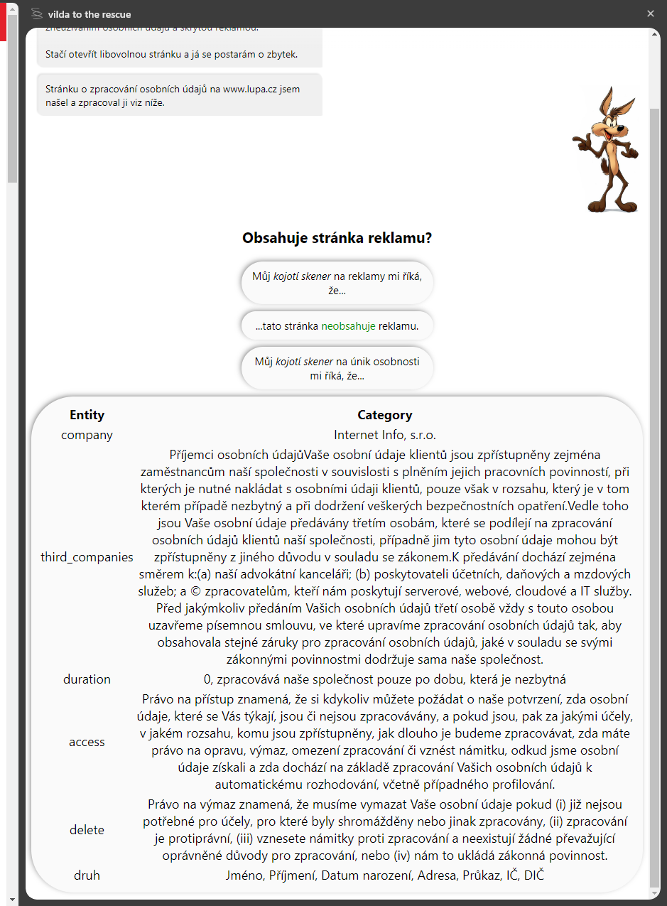

# How to use

1. Open Mozilla Firefox
2. goto `about:debugging`
3. click on `This Firefox` (under `Setup` in the left bar)
4. click on `Load Temporary Add-on...`
5. choose `manifest.json`

Kinda works for
<ul>
<li>https://www.okoun.cz/</li>
<li>https://www.lupa.cz/</li>
<li>https://www.abclinuxu.cz/</li>
<li>https://www.csfd.cz/</li>
<li>https://www.naucmese.cz/</li>
<li>https://rychlost.cz/ (weird behavior for 1st question)</li>
</ul>

Does not work for
<ul>
<li>http://linkuj.cz/</li>
<li>http://www.knihi.cz/</li>
</ul>